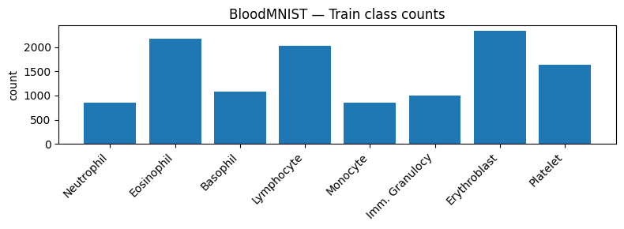
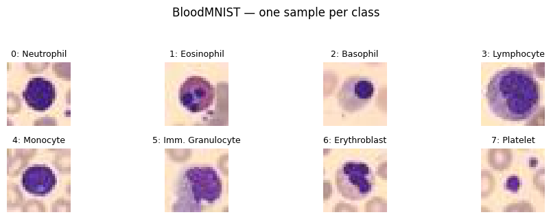
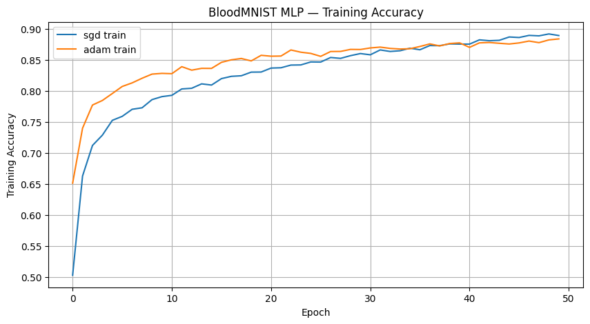
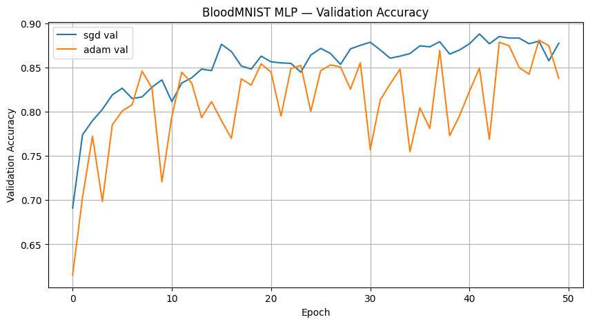
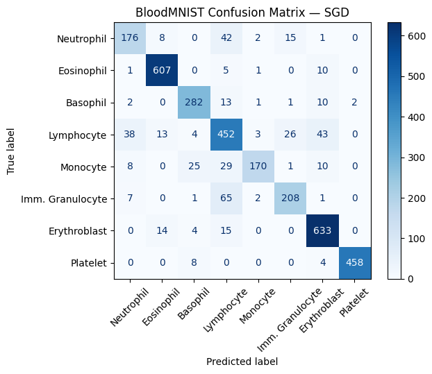
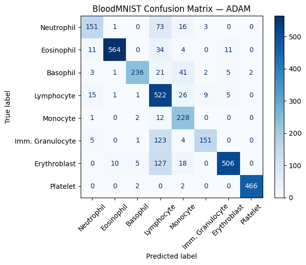

# Biomedical Image Classification & Analysis

A deep learning project using **PyTorch** to classify **17,000+ biomedical images across 8 blood cell classes**. The project compares SGD and Adam optimization strategies and evaluates model performance through training curves, validation accuracy, and class-level error analysis.

## Project Overview

This project explores biomedical image classification using a **Multi-Layer Perceptron (MLP)** trained on the BloodMNIST dataset.

The analysis focuses on:

- Exploring blood cell class distributions
- Preprocessing biomedical image data
- Building and training a PyTorch neural network
- Comparing SGD and Adam optimizers
- Improving generalization through batch normalization and dropout
- Evaluating training and validation performance
- Analyzing classification errors using confusion matrices

## Dataset

The project uses the **BloodMNIST** dataset, containing **17,092 blood cell images across 8 classes**.

| Split | Images |
|---|---:|
| Training | 11,959 |
| Validation | 1,712 |
| Testing | 3,421 |
| **Total** | **17,092** |

### Class Distribution

<p align="center">
  
</p>

The training dataset contains an uneven distribution of samples across the eight blood cell classes, making class-level evaluation important when assessing overall model performance.

### Sample Images

<p align="center">
  
</p>

The model classifies images into eight blood cell categories:

1. Neutrophil
2. Eosinophil
3. Basophil
4. Lymphocyte
5. Monocyte
6. Immature Granulocyte
7. Erythroblast
8. Platelet

## Technologies

**Python • PyTorch • NumPy • scikit-learn • Matplotlib • Weights & Biases • Jupyter Notebook**

## Data Preparation

BloodMNIST images were converted into PyTorch tensors and normalized from pixel values of **0–255 to 0–1**.

The data was separated into training, validation, and testing sets and loaded using PyTorch DataLoaders with a **batch size of 32**.

A fixed random seed was used to improve experiment reproducibility.

## Model Architecture

A fully connected **Multi-Layer Perceptron (MLP)** was developed for the classification task.

```text
28 × 28 × 3 Image
       ↓
   512 Neurons
       ↓
   256 Neurons
       ↓
   128 Neurons
       ↓
    8 Classes
```

The network incorporates:

- ReLU activation
- Batch normalization
- 50% dropout
- Cross-entropy loss
- Weight decay regularization

These techniques were used to improve training stability and reduce overfitting.

## Model Training

Two optimization strategies were compared over **50 epochs**.

| Optimizer | Learning Rate | Momentum | Weight Decay |
|---|---:|---:|---:|
| SGD | 0.001 | 0.9 | 0.0001 |
| Adam | 0.001 | — | 0.0001 |

Training and validation performance were monitored throughout the experiments, with the strongest validation model retained for evaluation.

## Training Performance

### Training Accuracy

<p align="center">
  
</p>

Adam converged more quickly during the early stages of training, while SGD gradually closed the performance gap over later epochs.

### Validation Accuracy

<p align="center">
  
</p>

SGD produced more stable validation performance across later epochs, while Adam showed greater epoch-to-epoch variation.

## Results

The strongest model achieved approximately **89% validation accuracy**.

| Model | Best Validation Accuracy |
|---|---:|
| **SGD MLP** | **88.79%** |
| Adam MLP | 88.08% |

Although Adam converged more quickly during early training, **SGD achieved the highest validation accuracy**.

This demonstrates that faster training convergence did not necessarily result in stronger validation performance.

## Classification Analysis

Confusion matrices were used to evaluate class-level performance and compare the types of classification errors produced by each optimizer.

### SGD vs. Adam

<table>
<tr>
<td align="center"><b>SGD</b></td>
<td align="center"><b>Adam</b></td>
</tr>
<tr>
<td>

</td>
<td>

</td>
</tr>
</table>

The SGD model demonstrated strong classification performance across several classes, particularly **Eosinophil, Erythroblast, and Platelet**.

The Adam model produced different class-level error patterns, including greater confusion between some blood cell categories.

Comparing both confusion matrices helped identify where optimizer choice affected classification performance beyond overall accuracy.

## Key Results

- Analyzed **17,092 biomedical images across 8 classes**
- Developed and trained a **PyTorch MLP**
- Compared **SGD and Adam across 50 epochs**
- Achieved **88.79% best validation accuracy**
- Applied **batch normalization, dropout, and weight decay**
- Evaluated class-level performance using **confusion matrices**
- Tracked model experiments using **Weights & Biases**

## Repository Structure

```text
Biomedical-Image-Classification/
│
├── README.md
├── Biomedical Classification.ipynb
│
└── images/
    ├── class_distribution.png
    ├── sample_images.png
    ├── training_accuracy.png
    ├── validation_accuracy.png
    ├── confusion_matrix_sgd.png
    └── confusion_matrix_adam.png
```

> **Note:** The BloodMNIST dataset is not stored in this repository due to file size. The notebook contains the workflow used to load and process the dataset.

## Future Improvements

Potential improvements to the project include:

- Replace the MLP with a **Convolutional Neural Network (CNN)**
- Apply image augmentation to improve generalization
- Perform additional hyperparameter tuning
- Evaluate precision, recall, and F1-score by class
- Investigate techniques for handling class imbalance
- Compare additional optimizers and learning-rate strategies

## Author

**Alex Lee**

Data Science | Data Analytics | Machine Learning
